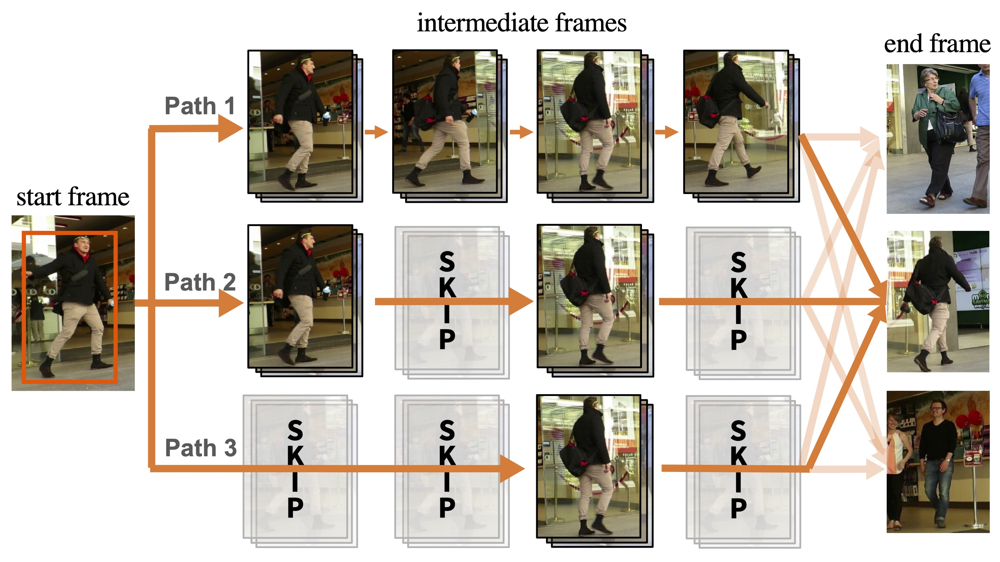

<h2 align="center"> <a href="https://openaccess.thecvf.com/content/CVPR2024/papers/Lu_Self-Supervised_Multi-Object_Tracking_with_Path_Consistency_CVPR_2024_paper.pdf">Self-Supervised Multi-Object Tracking with Path Consistency</a></h2>

We propose a novel concept of path consistency to learn robust object matching without using manual object identity supervision. Our key idea is that, to track a object through frames, we can obtain multiple different association results from a model by varying the frames it can observe, i.e., skipping frames in observation. As the differences in observations do not alter the identities of objects, the obtained association results should be consistent. Based on this rationale, we formulate new Path Consistency Loss and have achieved SOTA on three tracking datasets (MOT17, PersonPath22, KITTI).



## Preparation
### Install dependencies
```shell
pip3 install -r requirements.txt
cd libs
git clone https://github.com/ifzhang/ByteTrack.git
git clone https://github.com/JonathonLuiten/TrackEval.git
```

### Preprocess data
- download [MOT17 data](https://motchallenge.net/data/MOT17.zip), unzip it and place it as `data/mot17`
- download Tracktor++ detection from [drive](https://drive.google.com/file/d/179RgC8vidky7naAQc8Zuj2fIfeF17CsZ/view?usp=sharing) and place it as `data/mot17/tracktor_det`
- preprocess MOT17 data via `python -m src.script.preprocesss_mot17`

## Train model
```bash
python -m src.train --cfg src/configs/mot.yaml --set aux.gpu $GPUID aux.runid 1
```
This will train model on MOT17 public detections. Following prior works, the detections are refined by Tracktor++.
Results will be saved at `log/mot/1`. `ckpts` folder stores model weights. `saves` folder stores the accuracy of learned matching probability. Losses and accuracies are also visualized via wandb.

## Evaluate model
```bash
python -m src.inference_mot --gpu $GPUID --exp log/mot17/public/all/mot/1/
```
This will evaluate model on MOT17 train and test videos, save results to `output/MOT17`, and print the accuracy for training videos. Accuracy for test videos can be obtained by submitting to MOT17 server.

## Pretrained Model
Pretrained model and results can be downloaded from [drive](https://drive.google.com/file/d/1R5hCZ32fX128ciezeaYr42AzAnjUccd6/view?usp=sharing). It contains `log` and `output` folders with the following performance:

|              | MOTA | IDF1 | IDSW |
|--------------|------|------|------|
| Train Videos | 64.8 | 69.0 | 542  |
| Test Videos  | 58.8 | 61.0 | 1162 |


## In Progress
The training configs for PersonPath and KITTI are exactly the same as defined in `src/configs/mot.yaml` except we set `pcl.G=20`. Unfortunately, we lost the data and model weights in a disk failure and need some time to replicate them. 

- [ ] update training setting for Personpath.
- [ ] update training setting for KITTI.

## Citation
```text
@InProceedings{Lu_2024_CVPR,
    author    = {Lu, Zijia and Shuai, Bing and Chen, Yanbei and Xu, Zhenlin and Modolo, Davide},
    title     = {Self-Supervised Multi-Object Tracking with Path Consistency},
    booktitle = {Proceedings of the IEEE/CVF Conference on Computer Vision and Pattern Recognition (CVPR)},
    month     = {June},
    year      = {2024},
    pages     = {19016-19026}
}
```


